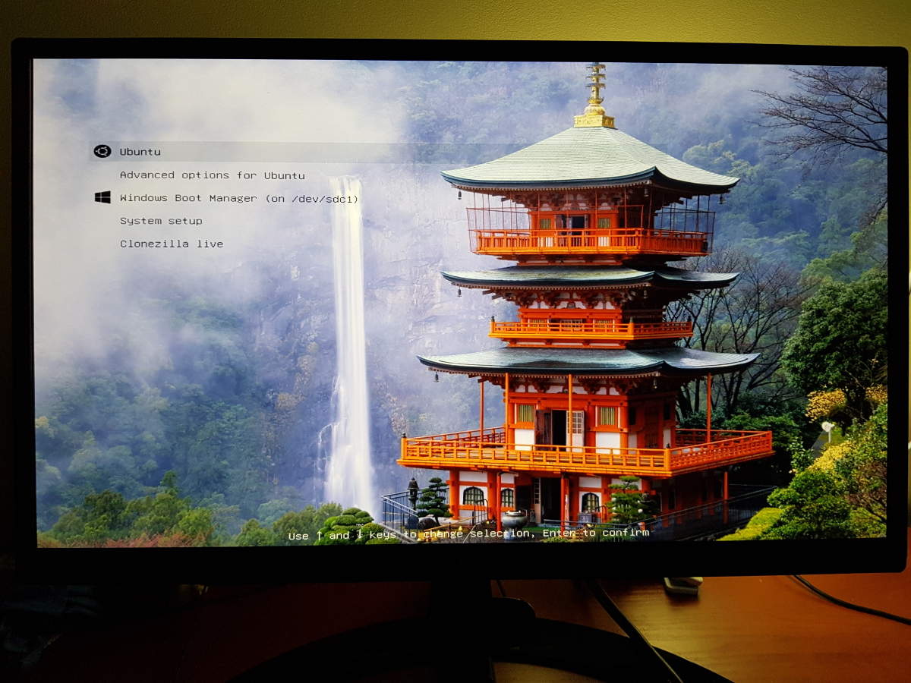

## GRUB 2 themes

##### Nachi Falls (4k)

### Installation

cd to directory with theme you are interested in and run `sudo install.sh`

### Credits

I used [Poly light GRUB theme](https://github.com/shvchk/poly-light) as an
example. Icons and font are taken from there.