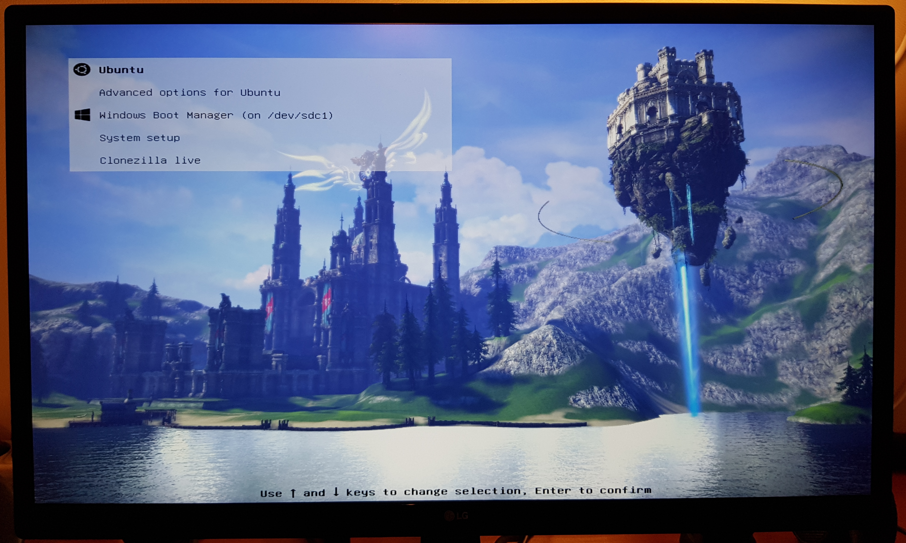

## GRUB 2 themes

##### Nachi Falls (4k)

##### Anime santa girl (4k)

##### Velika Outskirts (4k)

##### Velika (4k)

##### Tera Elf Priest (4k)

##### Seoul at night (4k)

### Installation

cd to directory with theme you are interested in and run `sudo install.sh`

### Credits

I used [Poly light GRUB theme](https://github.com/shvchk/poly-light) as starting point. 
Icons and font are taken from there.
